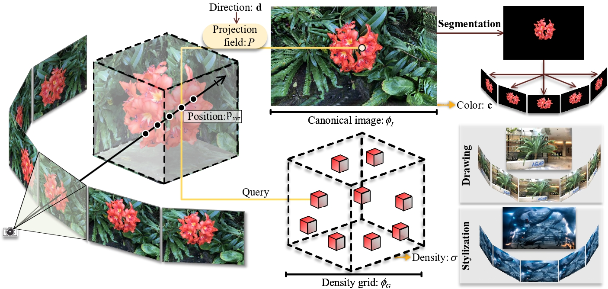
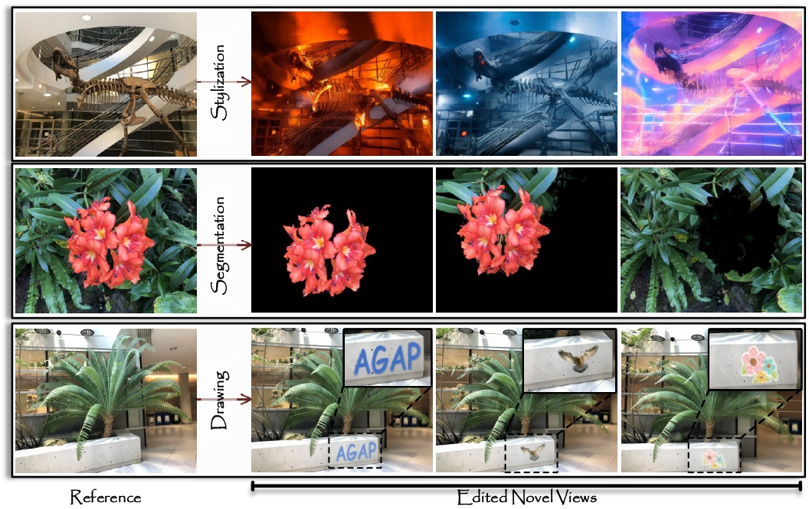

# AGAP

**Official PyTorch Implementation for [Learning Naturally Aggregated Appearance for Efficient 3D Editing](https://felixcheng97.github.io/AGAP/).**

**External Links: [Arxiv](https://klchengad.student.ust.hk/research/agap/paper.pdf), [Paper](https://klchengad.student.ust.hk/research/agap/paper.pdf), [Project Page](https://felixcheng97.github.io/AGAP/)**

> **Learning Naturally Aggregated Appearance for Efficient 3D Editing** <br>
>  Ka Leong Cheng<sup>1,2</sup>, Qiuyu Wang<sup>2</sup>, Zifan Shi<sup>1,2</sup>, Kecheng Zheng<sup>2,3</sup>, Yinghao Xu<sup>2,4</sup>, Hao Ouyang<sup>1,2</sup>, Qifeng Chen<sup>1&dagger;</sup>, Yujun Shen<sup>2&dagger;</sup> <br>
>  <sup>1</sup>HKUST, <sup>2</sup>Ant Research, <sup>3</sup>CAD&CG ZJU, <sup>4</sup>Stanford<br>




## Abstract
Neural radiance fields, which represent a 3D scene as a color field and a density field, have demonstrated great progress in novel view synthesis yet are unfavorable for editing due to the implicitness. In view of such a deficiency, we propose to replace the color field with an explicit 2D appearance aggregation, also called canonical image, with which users can easily customize their 3D editing via 2D image processing. To avoid the distortion effect and facilitate convenient editing, we complement the canonical image with a projection field that maps 3D points onto 2D pixels for texture lookup. This field is carefully initialized with a pseudo canonical camera model and optimized with offset regularity to ensure **naturalness** of the aggregated appearance. Extensive experimental results on three datasets suggest that our representation, dubbed **AGAP**, well supports various ways of 3D editing (*e.g.*, stylization, interactive drawing, and content extraction) with no need of re-optimization for each case, demonstrating its generalizability and efficiency.


## Installation
This repository is developed based on a Linux machine with the following:
* Ubuntu 20.04.6
* NVIDIA-SMI 525.147.05
* Driver Version: 525.147.05
* CUDA Version: 12.0
* GPU: NVIDIA RTX A6000

Clone this repository and set up the environment. 
```bash
git clone https://github.com/felixcheng97/AGAP.git
cd AGAP
conda create -n agap python=3.8 -y
conda activate agap
pip install torch==2.0.1 torchvision==0.15.2 torchaudio==2.0.2 --index-url https://download.pytorch.org/whl/cu117
pip install tqdm
pip install mmcv==1.7.1
pip install opencv-python
pip install imageio==2.26.0
pip install scipy
pip install torch_scatter==2.1.1
pip install imageio-ffmpeg
pip install torch_efficient_distloss==0.1.3
pip install einops
pip install matplotlib
pip install yapf==0.40.1
```
Upto now, your environment is ready for running PE models. Optionally, you can choose to install tinycudann for running hash models.
```bash
git clone --recursive https://github.com/nvlabs/tiny-cuda-nn
cd tiny-cuda-nn/bindings/torch
python setup.py install
cd ../../..
```
If you encounter problems, please follow their official instructions [here](https://github.com/NVlabs/tiny-cuda-nn.git). Make sure that your cuda version is compatiable with tinycudann. In our case, we use cuda version 11.7 with tinycudann version 1.7.


## Dataset Preparation
We provide the download links for the LLFF dataset with forward-facing scenes and the Replica dataset with panorama scenes. Place the unzipped datasets under the `./data` directory with the following structure:
```
.
`-- data
    |-- nerf_llff_data     # Link: https://drive.google.com/drive/folders/128yBriW1IG_3NJ5Rp7APSTZsJqdJdfc1
    |   |-- fern
    |   |-- ...
    |   `-- trex
    `-- somsi_data         # Link: https://drive.google.com/drive/folders/1baI9zZCOJyjI278LCylnHWNF41KI-JkF?usp=sharing
        `-- replica
            |-- scene_00
            |-- ...
            `-- scene_13
```


## Training
To train a scene (*e.g.*, PE model of the *trex* scene in the LLFF dataset), run the following script:
```bash
CUDA_VISIBLE_DEVICES=0 python run.py --config configs/llff/trex_lg_pe.py --render_train --dump_images --no_reload
```
We provide our pre-trained models in our paper for your reference (LLFF: [hash](https://hkustconnect-my.sharepoint.com/:f:/g/personal/klchengad_connect_ust_hk/EqdNyVpaxJ5GvJFJxhmdNeMBpjWCVnZXT8vrg8oTWvMOGA?e=fQEYif), [PE](https://hkustconnect-my.sharepoint.com/:f:/g/personal/klchengad_connect_ust_hk/Ej1wBm77COFFjs154RVObw4B9PEhCrx1CKKsFII6fcxadw?e=aczaKf) | Replica: [hash](https://hkustconnect-my.sharepoint.com/:f:/g/personal/klchengad_connect_ust_hk/Eussrb6iEk5MsueueoKQbigBG2OwejKxVg3t3RcUGhUHJA?e=XMZTMH), [PE](https://hkustconnect-my.sharepoint.com/:f:/g/personal/klchengad_connect_ust_hk/EsDKMERa72xLti6U_9B0FLIBSeiRm0crUhyq8Ean_mgltQ?e=YES3c9)). Unzip the zip files and place the pretrained models under the `./logs` directory with the following structure:
```
.
`-- logs
    |-- llff_hash        # Link: https://hkustconnect-my.sharepoint.com/:f:/g/personal/klchengad_connect_ust_hk/EqdNyVpaxJ5GvJFJxhmdNeMBpjWCVnZXT8vrg8oTWvMOGA?e=fQEYif
    |   |-- fern_lg_hash
    |   |-- ...
    |   `-- trex_lg_hash
    |-- llff_pe          # Link: https://hkustconnect-my.sharepoint.com/:f:/g/personal/klchengad_connect_ust_hk/Ej1wBm77COFFjs154RVObw4B9PEhCrx1CKKsFII6fcxadw?e=aczaKf
    |   |-- fern_lg_pe
    |   |-- ...
    |   `-- trex_lg_pe
    |-- replica_hash     # Link: https://hkustconnect-my.sharepoint.com/:f:/g/personal/klchengad_connect_ust_hk/Eussrb6iEk5MsueueoKQbigBG2OwejKxVg3t3RcUGhUHJA?e=XMZTMH
    |   |-- scene_00_hash
    |   |-- ...
    |   `-- scene_13_hash
    `-- replica_pe       # Link: https://hkustconnect-my.sharepoint.com/:f:/g/personal/klchengad_connect_ust_hk/EsDKMERa72xLti6U_9B0FLIBSeiRm0crUhyq8Ean_mgltQ?e=YES3c9
        |-- scene_00_pe
        |-- ...
        `-- scene_13_pe
```


## Testing
To test a pre-trained scene (*e.g.*, PE model of the *trex* scene in the LLFF dataset), run the following script:
```bash
CUDA_VISIBLE_DEVICES=0 python run.py --config configs/llff/trex_lg_pe.py --render_test --render_video --dump_images
```


## Editing
To edit a pre-trained scene (*e.g.*, PE model of the *trex* scene in the LLFF dataset), we can perform 2D editing on the canonical image `./logs/llff_pe/trex_lg_pe/k0.png` for 3D editing, including scene stylization, content extraction, and texture editing.



### 1. Scene Stylizaiton
For scene stylization, we make use of ControlNet to do global stylization on the canonical image given a text prompt. You could install the ControlNet v1.1 through the official github at [here](https://github.com/lllyasviel/ControlNet-v1-1-nightly.git) and use "gradio" for an interactive editing. Alternatively, you can also try their online deployment on hugging face at [here](https://huggingface.co/spaces/hysts/ControlNet-v1-1).

Note: it is suggested to ensure the edited canonical image has the same resolution as the pre-edit canonical image to avoid resizing when testing. The demo cases of scene stylization shown in the main paper and the project page are mainly based on the "Lineart" and "Lineart (anime)" model of ControlNet v1.1.

Say that you have your edited canonical image ready as `./logs/llff_pe/trex_lg_pe/k0_scene_stylization.png`, you can run the following script to render novel views of the stylized scene:
```bash
CUDA_VISIBLE_DEVICES=0 python run.py --config configs/llff/trex_lg_pe.py --render_video --dump_images --edit scene_stylization
```

### 2. Content Extraction
For content extraction, we mainly make use of the Segment Anything Model (SAM) to do a coarse and fast extraction of different objects on the canonical image. You can install their model following the official installzation guide at [here](https://github.com/facebookresearch/segment-anything). Here, we provide an example script for processing.
```
CUDA_VISIBLE_DEVICES=0 python extract.py
```

Say that you have your edited canonical image ready as `./logs/llff_pe/trex_lg_pe/k0_content_extraction.png`, you can run the following script to render novel views of the edited scene:
```bash
CUDA_VISIBLE_DEVICES=0 python run.py --config configs/llff/trex_lg_pe.py --render_video --dump_images --edit content_extraction
```

### 3. Texture Editing
For texture editing, you can directly do painting or drawing on the canonical image for explicit editing. Say that you have your edited canonical image ready as `./logs/llff_pe/trex_lg_pe/k0_texture_editing.png`, you can run the following script to render novel views of the edited scene:
```bash
CUDA_VISIBLE_DEVICES=0 python run.py --config configs/llff/trex_lg_pe.py --render_video --dump_images --edit texture_editing
```


## Acknowledgement
This repository is built based on [DVGO](https://github.com/sunset1995/DirectVoxGO).


## Citation
If you find this work useful, please cite our paper:
```
@article{cheng2023learning,
    title     = {Learning Naturally Aggregated Appearance for Efficient 3D Editing}, 
    author    = {Ka Leong Cheng and Qiuyu Wang and Zifan Shi and Kecheng Zheng and Yinghao Xu and Hao Ouyang and Qifeng Chen and Yujun Shen},
    year      = {2023},
    website   = {https://felixcheng97.github.io/AGAP/},
    journal   = {arXiv:????.?????},
}
```

## Contact
Feel free to open an issue if you have any question. You could also directly contact us through email at klchengad@connect.ust.hk (Ka Leong Cheng).